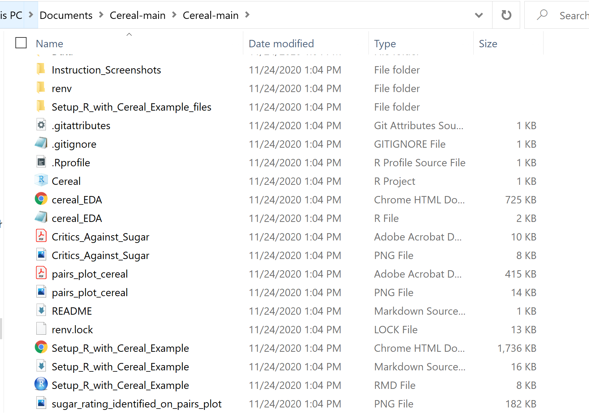

# Step 0: Setting up R

The statistical programming language R is great for quick analysis with 
minimal headaches. You can download R and R Studio, install packages 
directly from CRAN and be off to the races within minutes. 

Unfortunately, this isn't always amenable to good science that is reproducible. 
So this document shows a quick R Setup using R Projects, Github for Desktop,
and the renv package to have a true first step for reproducible analysis. 

## 1) Programs 

I recommend the following programs: 

- [Github for Desktop](https://desktop.github.com/)
- [R (I use 4.0.3)](https://cran.r-project.org/bin/windows/base/)
- [RStudio](https://rstudio.com/products/rstudio/download/)

## 2) File Folders 

It's best to be on a mapped drive; it makes R behave a lot better. If you're 
in a network drive (like I am when I use my client laptop as a consultant)
you can simply "map" that folder to a new drive. For example, on one laptop
I mapped my "//client/username/virtual_machine/Documents/Carlos/" to become 
"R:/Carlos/".

Then you'll want to do the following: 

1. Create a new repo with Github for Desktop


Notice I selected the R gitignore, this makes my repo a lot cleaner by
not tracking temporary files (e.g. don't version control where my mouse
last was when I closed my R Project).

2. Create a new R project as an existing directory and select the 
repo folder made by Github in step 1. 


## 3) Package Management 

Different versions of packages have different functions and given the 
interdependency of packages that build on each other, it is critical
to sort out which packages *your analysis* relied on to have its outputs. 

This is the core principle of reproducible programming. The same inputs,
under the same conditions, should always return the same output. 

Package management ensures the *same conditions* part holds true (well, as true 
as it can. In real life this is incredibly hard and involves concepts like
virtualization and tools like Docker or Kubernetes to abstract away from
Windows/Mac compiler/assembly level issues using "Containers".)

While [Docker](https://colinfay.me/docker-r-reproducibility/) is outside the scope of this tutorial, it is the logical next step for someone interested in really preventing reproducibility problems long-term at a data science organization.
This tutorial is scoped for more individual-level reproducibility and good
programming practices in R. 

1. install the renv package, load it, and activate it. 


```r
install.packages("renv")
library(renv)
renv::activate()
```

This will change your library paths to a new library and also update 
your git repo to strategically ignore and commit files that ensure 
packages can be tracked. 


```r
.libPaths()
```

```
## [1] "C:/Users/carlo/Documents/Messing with R/Cereal/renv/library/R-4.0/x86_64-w64-mingw32"
## [2] "C:/Users/carlo/AppData/Local/Temp/RtmpaudAot/renv-system-library"
```


2. Now, when you install packages relevant to your analysis, renv will
track the packages and their versions while installing their dependencies. 

Here I **snapshot** my current packages in use and renv identifies that 
I have a bunch of packages not yet in my lock file (you may notice
these packages are the packages for creating R Markdown documents like this one!)


## 4) Example Analysis 

Now, with my packages being tracked, my R Project ensuring portability across
other peoples computers, and Github serving as version control of my code, I'm
ready to do an analysis and show how renv ensures it is reproducible! 

### Background Note 

Selecting the [Cereal dataset](https://www.kaggle.com/crawford/80-cereals)
from the fun [beginner friendly datasets](https://www.kaggle.com/rtatman/fun-beginner-friendly-datasets) Kaggle page, I'll do a quick pair-plots exploration and then a more purposeful
visualization showing a relationship I found.

I may owe it to the reader to quickly link to some statistical philosophy sources
on why this is an *analytics* example and not a *statistics* or *machine learning* one. Most specifically, there isn't any decision to make under uncertainty. 

[We have what we have and it says what it says.](https://www.kdnuggets.com/2019/09/difference-analytics-statistics.html)


### Read Data

Read in the Cereal dataset in my Data folder. Merge in the full 
manufacturer names (instead of just the first letter). 


```r
library(ggplot2)
# Load and Clean Up 
cereal <- read.csv("Data/cereal.csv", stringsAsFactors = TRUE)

# Manufacturer Names

full_name_merge_tbl <- data.frame(
  mfr = c("A","G","K","N","P","Q","R"),
  MFR_Name = c(
    "American Home",
    "General Mills",
    "Kelloggs",
    "Nabisco",
    "Post",
    "Quaker Oats",
    "Ralston Purina")
)

cereal <- merge( x = cereal, y = full_name_merge_tbl)

knitr::kable(head(cereal))
```


|mfr |name                    |type | calories| protein| fat| sodium| fiber| carbo| sugars| potass| vitamins| shelf| weight| cups|   rating|MFR_Name      |
|:---|:-----------------------|:----|--------:|-------:|---:|------:|-----:|-----:|------:|------:|--------:|-----:|------:|----:|--------:|:-------------|
|A   |Maypo                   |H    |      100|       4|   1|      0|   0.0|  16.0|      3|     95|       25|     2|   1.00| 1.00| 54.85092|American Home |
|G   |Apple Cinnamon Cheerios |C    |      110|       2|   2|    180|   1.5|  10.5|     10|     70|       25|     1|   1.00| 0.75| 29.50954|General Mills |
|G   |Cocoa Puffs             |C    |      110|       1|   1|    180|   0.0|  12.0|     13|     55|       25|     2|   1.00| 1.00| 22.73645|General Mills |
|G   |Total Corn Flakes       |C    |      110|       2|   1|    200|   0.0|  21.0|      3|     35|      100|     3|   1.00| 1.00| 38.83975|General Mills |
|G   |Count Chocula           |C    |      110|       1|   1|    180|   0.0|  12.0|     13|     65|       25|     2|   1.00| 1.00| 22.39651|General Mills |
|G   |Basic 4                 |C    |      130|       3|   2|    210|   2.0|  18.0|      8|    100|       25|     3|   1.33| 0.75| 37.03856|General Mills |

### Investigate Pairs Plot

A pairs plot shows the intersection of all variables as (small and 
often difficult to read) scatterplots. This is useful for identifying quick
relationships of interest, for example, the relationship between the grams
of sugar per serving and the consumer report rating. 

Instead of plotting directly, here is the code for saving it as a PNG and a PDF. 
I personally like saving plots as PDFs because it is cleaner to zoom in and 
extract sections. 


```r
# Remove cereal label column "name" and duplicative column "MFR_Name"
png(file = "pairs_plot_cereal.png")
pairs(cereal[, - which(colnames(cereal) %in% c("name","MFR_Name"))])
dev.off()

pdf(file = "pairs_plot_cereal.pdf")
pairs(cereal[, - which(colnames(cereal) %in% c("name","MFR_Name"))])
dev.off()
```

Here is the intersection of interest zoomed in. Like a correlation plot, the 
diagonal is shown as the reference and each relationship is duplicated (you
can either look at the bottom triangle or the top triangle of a pairs plot). 


The slope is negative, which frankly, I didn't expect; In my mind a little
bit of sugar is good up to a point and then it gets to be too much later. The
critics disagree, they seems to dislike sugar all-around. 

### The Critics Hate Sugar

This plot shows the relationship of interest in more detail. The negative
correlation between sugar in cereal and the cereal's rating across the 7
manufacturers. 


```r
gg <- ggplot(cereal, aes(x = sugars, y = rating)) + 
  geom_point(aes(col = MFR_Name)) +
  geom_smooth(method = "lm", se = FALSE,
              linetype = "dashed", color = "black") +
  labs(x = "Sugar (grams) per serving", 
       y = "Consumer Report Ratings", 
       title="Cereal Critics Rail Against Big Sugar",
       subtitle = "A gram of sugar costs you nearly 2.5 points!",
       caption = "Source: kaggle.com/crawford/80-cereals") + theme_classic() + 
  theme(axis.title = element_text(size = rel(1.25)), 
        plot.title = element_text(size = rel(1.3), hjust = 0.5),
        plot.subtitle = element_text(size = rel(1.3), hjust = 0.5))
gg$labels$colour <- "Cereal Manufacturer"

gg
```

<!-- -->

## 5) Reproducibility 

Ok, so why did I do all that work if I'm just using ggplot2 and
RMarkdown?

Because now YOU can run this code too. 

1. Go to [my Cereal repo github](https://github.com/CR-Mercado/Cereal) and 
download the zip folder. 


2. Extract it somewhere (pretty much anywhere!); here I extract it to a 
totally different folder in my directory. 
 

Notice the Renv folder
doesn't have the custom libraries (we'll restore those to prove reproducibility).

 

3. Open the R Project (notice it's portable and has the updated 
working directory). 

 

4. Then Restore the R Project 


```r
 # Run this in your copy of the R Project. 
renv::restore() 
```


5. And Voila, you can run this markdown file repeating the analysis with the
**exact** same package versions; the only thing left would be to get out 
of the operating system concerns using the virtualization items I mentioned above.

Thank you for reading! 

You can [follow me on LinkedIn](http://linkedin.com/in/crmercado) for more
data science, economics, R, GIS, and related notes. 


